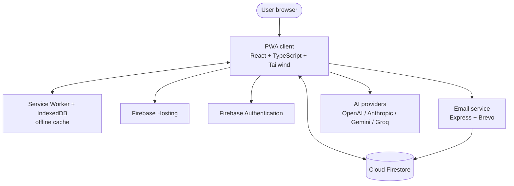

# RoomMate App

**English** | [Italiano](./README_IT.md)

[](https://reactjs.org/)
[](https://www.typescriptlang.org/)
[](https://tailwindcss.com/)
[](https://firebase.google.com/)
[](https://web.dev/progressive-web-apps/)

A Progressive Web App for managing shared households: expenses with balance calculation, cleaning rotations, a real-time shopping list, maintenance, announcements, polls, house rules with voting, and a unified calendar.

This repository presents RoomMate App to the public. It documents what the application does and how it is built. The source code is private; see [License](#license).

## Table of contents

- [Overview](#overview)
- [Screenshots](#screenshots)
- [Features](#features)
- [How it works](#how-it-works)
- [Tech stack](#tech-stack)
- [Architecture](#architecture)
- [Repository structure](#repository-structure)
- [Security](#security)
- [Feedback and support](#feedback-and-support)
- [License](#license)
- [Author](#author)

## Overview

RoomMate App covers the recurring friction of living with other people: who paid for what, whose turn it is to clean, what needs to go on the shopping list, and what the house has agreed on. Each household ("casa") groups its members, and every feature is scoped to that household.

The app is a single-page React application backed by Firebase (Authentication, Cloud Firestore, Hosting). A small Node.js service handles transactional email through Brevo. Data syncs in real time across devices, and the PWA layer keeps core features available offline.

It runs in English and Italian, with language switching from the user profile.

## Screenshots


*Household overview: members, invite code, and quick access to every section.*

<table>
  <tr>
    <td width="50%"><br><sub>Expenses with automatic balance calculation and minimized settlements.</sub></td>
    <td width="50%"><br><sub>Weekly cleaning rotation by member and task.</sub></td>
  </tr>
  <tr>
    <td width="50%"><br><sub>Unified calendar with recurring shifts and events.</sub></td>
    <td width="50%"><br><sub>Real-time shopping list with purchased-item tracking.</sub></td>
  </tr>
</table>

## Features

### Expenses and balances

- Split expenses equally, by custom amount, or by percentage
- Real-time balance calculation that minimizes the number of settlement transactions
- Recurring expenses for monthly bills (rent, utilities, subscriptions)
- Categories: bills, groceries, rent, cleaning, maintenance
- Monthly charts and category breakdowns
- PDF and CSV export for any time range
- Reimbursement requests and tracking between members

### Cleaning rotations

- Multiple scenarios with weekly, bi-weekly, or monthly frequency
- Automatic rotation among members with customizable patterns
- Task types: kitchen, bathroom, general, trash, and custom
- Optional AI-generated schedules based on rooms, frequency, and member preferences
- Completion tracking with timestamps and reminders for upcoming or overdue shifts
- One-off and exceptional shifts

### Shopping list

- Real-time synchronization across all devices
- Categories: food, beverages, household, personal care
- Priority levels (high, medium, low)
- Tracking of who bought what and when
- Conversion of purchased items into a shared expense

### Unified calendar

- Single view of cleaning shifts, maintenance, waste collection, and events
- Custom house events with descriptions
- Filtering and color coding by event type
- PDF export for printing

### Waste collection

- Recurring collection schedules per waste type (organic, plastic, paper, glass, metal, hazardous, and more)
- Reminders the evening before collection day
- Multiple scenarios for different seasons or locations

### Maintenance

- Tasks with priority (low, medium, high, urgent) and status tracking
- Optional assignment to a responsible member
- Email reminders for pending maintenance
- Full activity history

### Communication

- Announcement board with priority levels and pinning
- Single- or multiple-choice polls with real-time results
- Email delivery for announcements and polls

### House rules

- Rule proposals from any member, approved by majority vote
- Categories (cleaning, expenses, guests, noise, and more)
- Change and proposal history
- PDF export of the full rulebook

### Shared contacts

- Directory for landlord, plumber, electrician, and other contacts
- Categorization, tags, and favorites
- Click-to-call and click-to-email
- PDF export

### AI assistant

- Support for OpenAI, Anthropic Claude, Google Gemini, and Groq
- API keys stored either in the browser or in Firestore, at the user's choice
- Cleaning-schedule generation with provider preference and automatic fallback

### Member management

- Real members with full authenticated accounts
- Virtual members (NPCs) for tracking expenses of roommates without an account
- Admin and member roles with different permissions
- Profile merging when a virtual member creates a real account
- Invite codes for joining a household

### Progressive Web App

- Installable on mobile and desktop
- Core features available offline via Service Worker and IndexedDB
- Push notifications for relevant events
- Automatic sync when the connection is restored
- Automatic updates with user notification

## How it works

1. Register with email and password, then create a household or join one with an invite code.
2. Add members. Use virtual members for roommates who do not have an account yet.
3. Record expenses as they happen and let the app compute who owes whom, settling with the fewest transactions.
4. Set up a cleaning scenario (manually or with AI) and a waste-collection schedule; both feed the shared calendar.
5. Keep the shopping list, announcements, polls, and house rules in sync across everyone's devices.

## Tech stack

### Frontend

- React 18.2 with TypeScript 5.3
- Vite 5 build tool
- Tailwind CSS 3.3
- React Router 6.20 for routing
- Zustand 4.4 for authentication state, with custom hooks for data fetching
- React Hook Form 7.49 for forms
- Recharts 3.5 for charts
- date-fns 3.0 for date handling
- jsPDF 3.0 with jsPDF-AutoTable 5.0 for client-side PDF export
- Lucide React for icons
- Sentry for error monitoring

### Backend and infrastructure

- Firebase Authentication for accounts and sessions
- Cloud Firestore as the real-time database
- Firebase Hosting for static delivery
- Node.js with Express for the email microservice
- Brevo for transactional email

### AI providers

- OpenAI, Anthropic Claude, Google Gemini, and Groq, selected per user

### Tooling

- ESLint and TypeScript for static checks
- Vitest for the frontend and the email service
- Husky with lint-staged for pre-commit checks
- Firebase CLI for deployment

## Architecture



The client talks to Firebase directly for authentication and data, with Firestore Security Rules enforcing access at the database level. The email service is the only custom backend component; it reads household data from Firestore and sends mail through Brevo. AI calls go straight from the client to the chosen provider using the user's own API key.

## Repository structure

The application source is organized as follows. This repository contains only the documentation files listed at the end.

```text
roommate-app/
├── frontend/                  # React application
│   ├── src/
│   │   ├── components/        # UI components (modals, cards, sections)
│   │   ├── pages/             # Application pages (lazy loaded)
│   │   ├── services/          # Firebase and API access
│   │   ├── hooks/             # Custom React hooks
│   │   ├── store/             # Zustand auth store
│   │   ├── i18n/              # Italian and English translations
│   │   ├── config/           # Firebase and performance config
│   │   └── utils/            # Export helpers and shared logic
│   └── public/               # PWA manifest, service worker, icons
├── email-service/            # Node.js email microservice
│   ├── server.js             # Express server
│   └── middleware/           # CORS, helmet, rate limiting
├── firestore.rules           # Firestore security rules
├── firestore.indexes.json    # Firestore compound indexes
└── firebase.json             # Hosting config and security headers
```

## Security

Access to household data is enforced by Firestore Security Rules at the database level, rather than in the UI alone. The frontend is served with a strict Content-Security-Policy, HSTS, and frame and content-type protections. The email service uses Helmet, a CORS allowlist, and rate limiting.

To report a vulnerability, see [SECURITY.md](./SECURITY.md). An Italian version is available in [SECURITY_IT.md](./SECURITY_IT.md).

## Feedback and support

Bug reports, feature requests, and questions are welcome through [GitHub Issues](https://github.com/AndreaBonn/RoomMatesByBonn/issues) or by email at andreabonacci95@protonmail.com.

Templates and details are in the [Feedback guide](./FEEDBACK.md).

## License

The documentation in this repository is published for reference. The application source code is private and proprietary, and is not included here. You may use the deployed application for personal, non-commercial purposes. For licensing or access inquiries, contact the author.

See [LICENSE.md](./LICENSE.md) for the full terms.

## Author

**Andrea Bonacci**

- GitHub: [@AndreaBonn](https://github.com/AndreaBonn)
- Email: andreabonacci95@protonmail.com

## Support the project

If this project is useful or interesting to you, consider leaving a star on [GitHub](https://github.com/AndreaBonn/RoomMatesByBonn). It helps others find it.

RoomMate App is free to use. If it helps you and you want to give something back, you can leave a tip via PayPal. The amount is up to you and it is entirely optional.

[](https://paypal.me/AndreaBonacci19)

---

[Italiano](./README_IT.md) · [Security](./SECURITY.md) · [Feedback](./FEEDBACK.md) · [License](./LICENSE.md)
