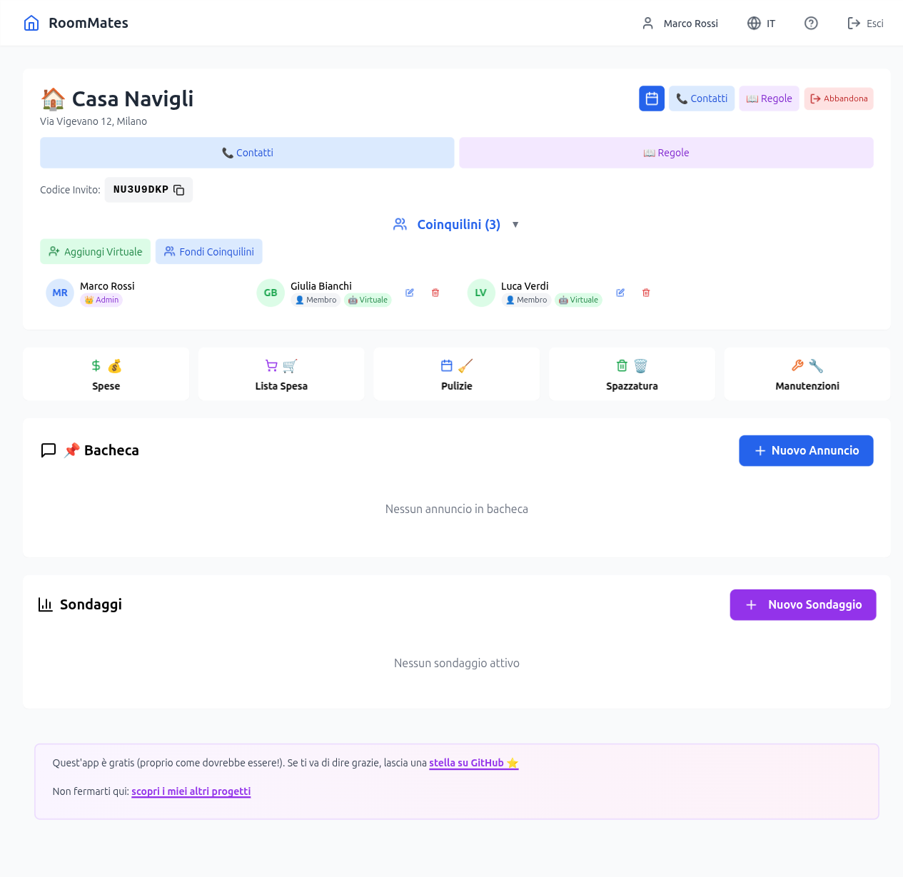
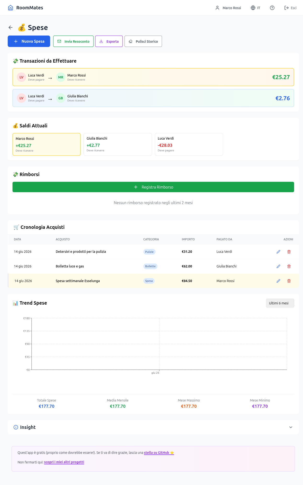
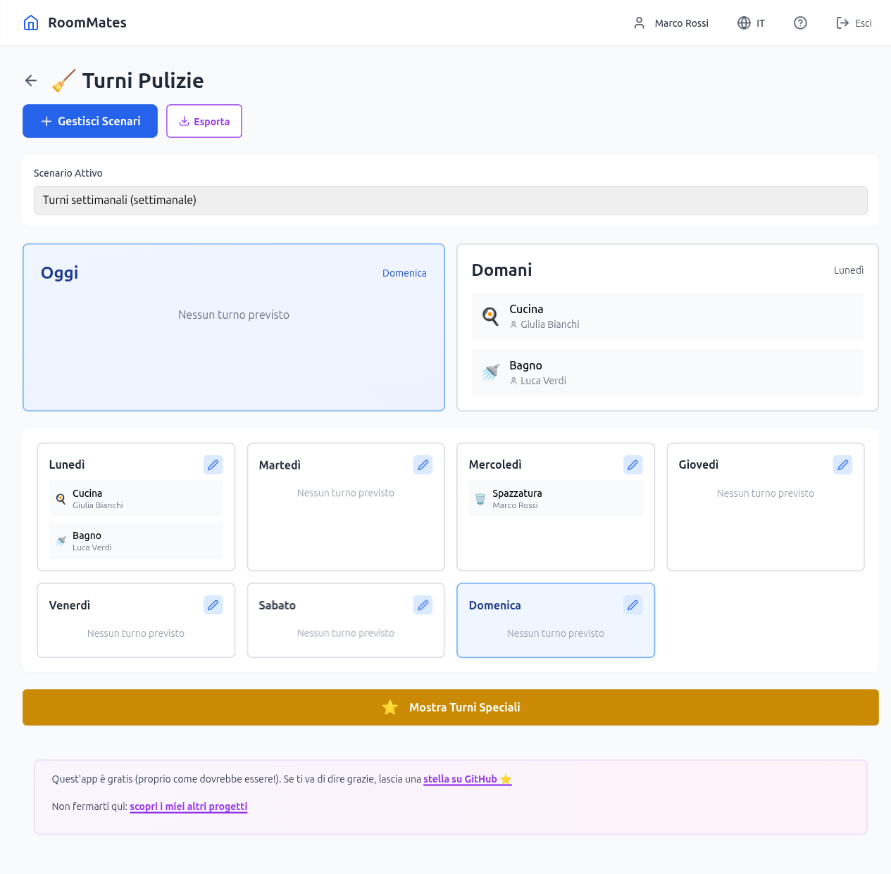
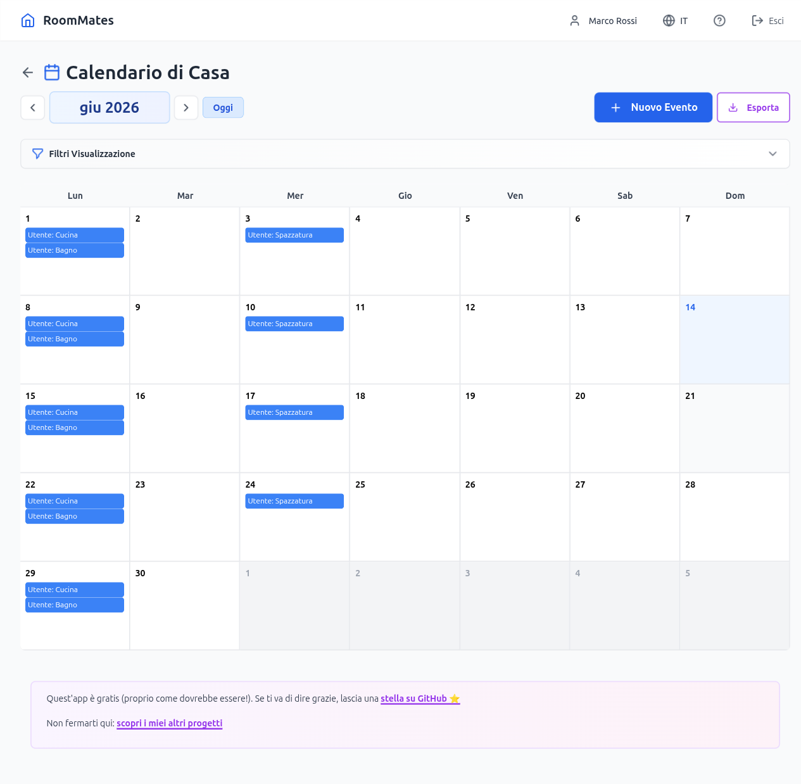
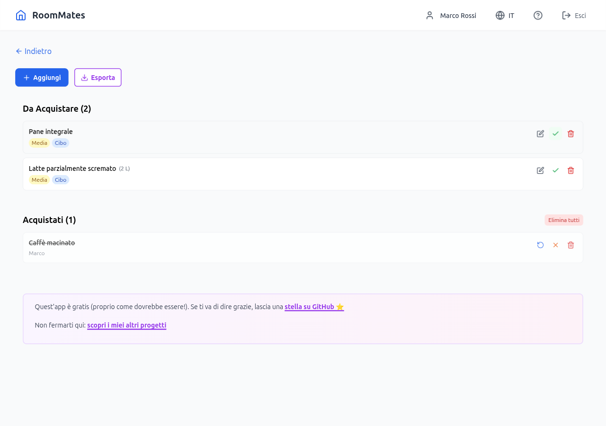
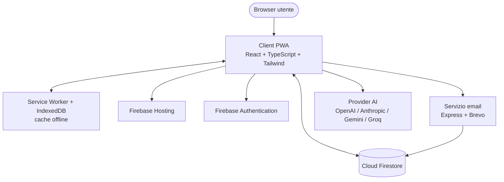

# RoomMate App

[English](./README.md) | **Italiano**

[](https://reactjs.org/)
[](https://www.typescriptlang.org/)
[](https://tailwindcss.com/)
[](https://firebase.google.com/)
[](https://web.dev/progressive-web-apps/)

Una Progressive Web App per gestire la convivenza tra coinquilini: spese con calcolo dei saldi, turni di pulizia, lista della spesa in tempo reale, manutenzioni, annunci, sondaggi, regole di casa con votazione e calendario unificato.

Questo repository è la vetrina pubblica di RoomMate App. Documenta cosa fa l'applicazione e come è costruita. Il codice sorgente è privato; vedi [Licenza](#licenza).

## Indice

- [Panoramica](#panoramica)
- [Screenshot](#screenshot)
- [Funzionalità](#funzionalità)
- [Come funziona](#come-funziona)
- [Stack tecnologico](#stack-tecnologico)
- [Architettura](#architettura)
- [Struttura del repository](#struttura-del-repository)
- [Sicurezza](#sicurezza)
- [Feedback e supporto](#feedback-e-supporto)
- [Licenza](#licenza)
- [Autore](#autore)

## Panoramica

RoomMate App affronta gli attriti ricorrenti del vivere con altre persone: chi ha pagato cosa, a chi tocca pulire, cosa va aggiunto alla lista della spesa e cosa la casa ha deciso. Ogni casa raggruppa i propri membri e ogni funzionalità è circoscritta a quella casa.

L'app è una single-page application React appoggiata su Firebase (Authentication, Cloud Firestore, Hosting). Un piccolo servizio Node.js gestisce l'invio di email transazionali tramite Brevo. I dati si sincronizzano in tempo reale tra i dispositivi e il livello PWA mantiene disponibili offline le funzioni principali.

Funziona in italiano e in inglese, con cambio lingua dal profilo utente.

## Screenshot



*Panoramica della casa: membri, codice invito e accesso rapido a ogni sezione.*

<table>
  <tr>
    <td width="50%"><br><sub>Spese con calcolo automatico dei saldi e transazioni ridotte al minimo.</sub></td>
    <td width="50%"><br><sub>Turni di pulizia settimanali per membro e mansione.</sub></td>
  </tr>
  <tr>
    <td width="50%"><br><sub>Calendario unificato con turni ricorrenti ed eventi.</sub></td>
    <td width="50%"><br><sub>Lista della spesa in tempo reale con tracciamento degli acquisti.</sub></td>
  </tr>
</table>

## Funzionalità

### Spese e saldi

- Suddivisione delle spese in parti uguali, per importo personalizzato o per percentuale
- Calcolo dei saldi in tempo reale che minimizza il numero di transazioni necessarie a saldare
- Spese ricorrenti per le bollette mensili (affitto, utenze, abbonamenti)
- Categorie: bollette, spesa, affitto, pulizie, manutenzione
- Grafici mensili e ripartizione per categoria
- Esportazione PDF e CSV per qualsiasi intervallo di date
- Richieste di rimborso e relativo tracciamento tra i membri

### Turni di pulizia

- Scenari multipli con frequenza settimanale, quindicinale o mensile
- Rotazione automatica tra i membri con schemi personalizzabili
- Tipi di mansione: cucina, bagno, generale, spazzatura e personalizzati
- Generazione opzionale dei turni tramite AI in base a stanze, frequenza e preferenze dei membri
- Tracciamento del completamento con timestamp e promemoria per i turni imminenti o in ritardo
- Turni una tantum ed eccezionali

### Lista della spesa

- Sincronizzazione in tempo reale su tutti i dispositivi
- Categorie: alimentari, bevande, casa, cura personale
- Livelli di priorità (alta, media, bassa)
- Tracciamento di chi ha comprato cosa e quando
- Conversione degli articoli acquistati in una spesa condivisa

### Calendario unificato

- Vista unica di turni di pulizia, manutenzioni, raccolta rifiuti ed eventi
- Eventi di casa personalizzati con descrizione
- Filtri e codifica a colori per tipo di evento
- Esportazione PDF per la stampa

### Raccolta differenziata

- Calendari di raccolta ricorrenti per tipo di rifiuto (organico, plastica, carta, vetro, metallo, pericolosi e altri)
- Promemoria la sera prima del giorno di raccolta
- Scenari multipli per stagioni o sedi diverse

### Manutenzioni

- Attività con priorità (bassa, media, alta, urgente) e tracciamento dello stato
- Assegnazione opzionale a un membro responsabile
- Promemoria via email per le manutenzioni in sospeso
- Storico completo delle attività

### Comunicazione

- Bacheca annunci con livelli di priorità e fissaggio in alto
- Sondaggi a scelta singola o multipla con risultati in tempo reale
- Invio via email di annunci e sondaggi

### Regole di casa

- Proposte di regole da parte di qualsiasi membro, approvate a maggioranza
- Categorie (pulizie, spese, ospiti, rumore e altre)
- Storico di modifiche e proposte
- Esportazione PDF del regolamento completo

### Contatti condivisi

- Rubrica per proprietario, idraulico, elettricista e altri contatti
- Categorizzazione, tag e preferiti
- Chiamata ed email con un clic
- Esportazione PDF

### Assistente AI

- Supporto per OpenAI, Anthropic Claude, Google Gemini e Groq
- Chiavi API salvate nel browser o su Firestore, a scelta dell'utente
- Generazione dei turni di pulizia con preferenza di provider e fallback automatico

### Gestione dei membri

- Membri reali con account autenticati completi
- Membri virtuali (NPC) per tracciare le spese di coinquilini senza account
- Ruoli admin e membro con permessi differenti
- Unione dei profili quando un membro virtuale crea un account reale
- Codici di invito per entrare in una casa

### Progressive Web App

- Installabile su mobile e desktop
- Funzioni principali disponibili offline tramite Service Worker e IndexedDB
- Notifiche push per gli eventi rilevanti
- Sincronizzazione automatica al ripristino della connessione
- Aggiornamenti automatici con avviso all'utente

## Come funziona

1. Registrati con email e password, poi crea una casa o entra in una esistente con un codice di invito.
2. Aggiungi i membri. Usa i membri virtuali per i coinquilini che non hanno ancora un account.
3. Registra le spese man mano che avvengono e lascia che l'app calcoli chi deve cosa a chi, saldando con il minor numero di transazioni.
4. Imposta uno scenario di pulizia (manualmente o con l'AI) e un calendario di raccolta rifiuti; entrambi alimentano il calendario condiviso.
5. Mantieni allineati lista della spesa, annunci, sondaggi e regole di casa su tutti i dispositivi.

## Stack tecnologico

### Frontend

- React 18.2 con TypeScript 5.3
- Build tool Vite 5
- Tailwind CSS 3.3
- React Router 6.20 per il routing
- Zustand 4.4 per lo stato di autenticazione, con custom hook per il data fetching
- React Hook Form 7.49 per i form
- Recharts 3.5 per i grafici
- date-fns 3.0 per la gestione delle date
- jsPDF 3.0 con jsPDF-AutoTable 5.0 per l'esportazione PDF lato client
- Lucide React per le icone
- Sentry per il monitoraggio degli errori

### Backend e infrastruttura

- Firebase Authentication per account e sessioni
- Cloud Firestore come database in tempo reale
- Firebase Hosting per la distribuzione statica
- Node.js con Express per il microservizio email
- Brevo per le email transazionali

### Provider AI

- OpenAI, Anthropic Claude, Google Gemini e Groq, selezionati per utente

### Strumenti

- ESLint e TypeScript per i controlli statici
- Vitest per il frontend e per il servizio email
- Husky con lint-staged per i controlli pre-commit
- Firebase CLI per il deploy

## Architettura



Il client comunica direttamente con Firebase per autenticazione e dati, con le Firestore Security Rules che applicano il controllo degli accessi a livello di database. Il servizio email è l'unico componente backend custom: legge i dati della casa da Firestore e invia le email tramite Brevo. Le chiamate AI partono direttamente dal client verso il provider scelto usando la chiave API dell'utente.

## Struttura del repository

Il sorgente dell'applicazione è organizzato come segue. Questo repository vetrina contiene solo i file di documentazione elencati in fondo.

```text
roommate-app/
├── frontend/                  # Applicazione React
│   ├── src/
│   │   ├── components/        # Componenti UI (modali, card, sezioni)
│   │   ├── pages/             # Pagine dell'app (lazy loaded)
│   │   ├── services/          # Accesso a Firebase e API
│   │   ├── hooks/             # Custom React hook
│   │   ├── store/             # Store di autenticazione Zustand
│   │   ├── i18n/              # Traduzioni italiano e inglese
│   │   ├── config/           # Configurazione Firebase e performance
│   │   └── utils/            # Helper di esportazione e logica condivisa
│   └── public/               # Manifest PWA, service worker, icone
├── email-service/            # Microservizio email Node.js
│   ├── server.js             # Server Express
│   └── middleware/           # CORS, helmet, rate limiting
├── firestore.rules           # Regole di sicurezza Firestore
├── firestore.indexes.json    # Indici composti Firestore
└── firebase.json             # Config hosting e security header
```

## Sicurezza

L'accesso ai dati della casa è applicato dalle Firestore Security Rules a livello di database, non soltanto nell'interfaccia. Il frontend è servito con una Content-Security-Policy stretta, HSTS e protezioni su frame e content-type. Il servizio email usa Helmet, una allowlist CORS e rate limiting.

Per segnalare una vulnerabilità, consulta [SECURITY_IT.md](./SECURITY_IT.md). È disponibile anche la versione inglese in [SECURITY.md](./SECURITY.md).

## Feedback e supporto

Segnalazioni di bug, richieste di funzionalità e domande sono benvenute tramite le [GitHub Issues](https://github.com/AndreaBonn/RoomMatesByBonn/issues) o via email all'indirizzo andreabonacci95@protonmail.com.

Template e dettagli sono nella [guida al feedback](./FEEDBACK_IT.md).

## Licenza

La documentazione di questo repository è pubblicata a scopo di riferimento. Il codice sorgente dell'applicazione è privato e proprietario e non è incluso qui. Puoi usare l'applicazione pubblicata per scopi personali e non commerciali. Per richieste di licenza o accesso, contatta l'autore.

Vedi [LICENSE.md](./LICENSE.md) per i termini completi.

## Autore

**Andrea Bonacci**

- GitHub: [@AndreaBonn](https://github.com/AndreaBonn)
- Email: andreabonacci95@protonmail.com

## Supporta il progetto

Se questo progetto ti è utile o interessante, lascia una stella su [GitHub](https://github.com/AndreaBonn/RoomMatesByBonn). Aiuta altri a scoprirlo.

RoomMate App è gratuita. Se ti è utile e vuoi contribuire, puoi lasciare un'offerta tramite PayPal. L'importo lo scegli tu ed è del tutto facoltativo.

[](https://paypal.me/AndreaBonacci19)

---

[English](./README.md) · [Sicurezza](./SECURITY_IT.md) · [Feedback](./FEEDBACK_IT.md) · [Licenza](./LICENSE.md)
